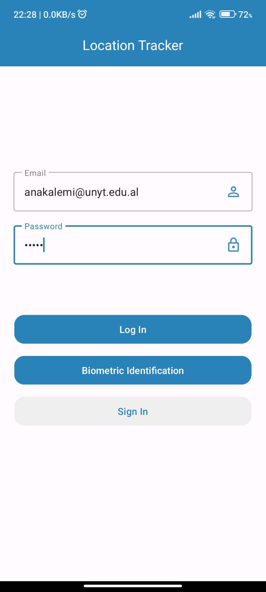
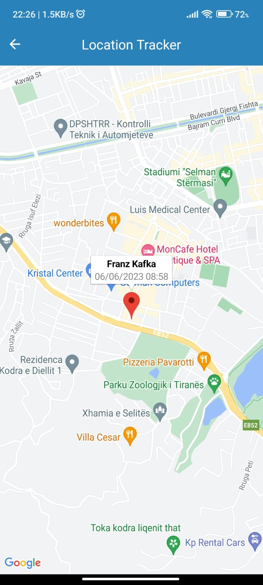
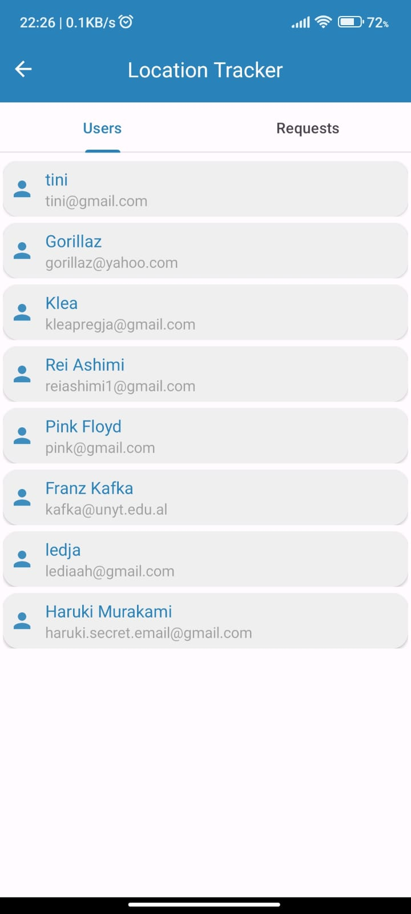
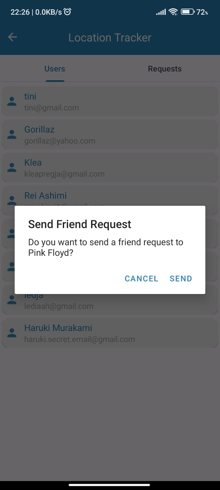

# Location Tracking App

The Location Tracking Android app is developed using
Java 17.0.5, Gradle version 8.0.0, Firebase Realtime Database, and Google Maps API. The app incorporates
various features including user authentication, biometric identification, real-time location
tracking, user registration, friend requests, and location sharing between friends.

## Table of Contents

- [Overview](#overview)
- [Features](#features)
- [Installation](#installation)
- [Usage](#usage)
- [Dependencies](#dependencies)
- [Configuration](#configuration)
- [Preview](#preview)

## Overview

This Android app is designed to provide users with a seamless experience for real-time location
tracking, user registration, and friend connections. It utilizes Firebase Realtime Database for data
storage and retrieval, as well as Google Maps API for displaying the location of users. 
The app allows users to log in using email and password or sign up with their name,
email, and password. Once logged in, users have the option of biometric identification for
future logins. The app maintains user sessions until explicitly logged out.

## Features

1. User Authentication:
    - Log in using email and password
    - Sign up using name, email, and password
    - Biometric identification for subsequent logins

2. Real-time Location Tracking:
    - Tracks the current location of the user
    - Updates the location in the home view at regular intervals (5-10 seconds)

3. User Registration and Friend Requests:
    - View registered users on the system (name, email)
    - Send friend requests to system users

4. Friend Connections and Location Sharing:
    - Establish friendship connections between users
    - View each other's real-time location
    - Display the timestamp of the last location update

## Installation

To install and run the Android app, follow these steps:

1. Clone the repository from GitHub:
   git
   clone [https://github.com/anakalemi/Location-Tracker-App.git](https://github.com/anakalemi/Location-Tracker-App)

2. Open the project in Android Studio.

3. Ensure that you have the required dependencies and configurations in place (refer
   to [Dependencies](#dependencies) and [Configuration](#configuration) sections).

4. Build the project and deploy it on an Android device or emulator.

## Usage

To use the app, follow these guidelines:

1. Launch the app on your Android device.

2. If you are a new user, click on the "Sign Up" button to create a new account using your name,
   email, and password. Otherwise, click on the "Log In" button and enter your credentials.

3. Optionally, use biometric identification for future logins.

4. Once logged in, the home view will display your current location, which updates at regular
   intervals.

5. To view other registered users, navigate to the Manage Friends section and browse the user list.

6. Send friend requests to other users on the dialog that appears when single-clicking one.

7. Once a friendship connection is established, you and your friend will be able to view each
   other's real-time location along with the timestamp of the last location update.

8. To end your session, click on the "Log Out" button.

## Dependencies

The Android app relies on the following dependencies:

- Firebase Realtime Database: Used for data storage and retrieval.
- Google Maps API: Utilized to display the location of the users.

Ensure that you have the necessary SDKs and libraries installed and configured in your project to
successfully use these dependencies.

## Configuration

To configure the app and enable necessary services, follow these steps:

1. Set up Firebase Realtime Database:

- Create a new Firebase project on the Firebase console (https://console.firebase.google.com).
- Add an Android app to your Firebase project, following the provided instructions.
- Download the `google-services.json` file and place it in the app module of your Android project.
- Add the necessary Firebase dependencies to your Gradle files.

2. Configure Google Maps API:

- Create a project on the Google Cloud Platform console (https://console.cloud.google.com).
- Enable the Google Maps Android API for your project.
- Obtain the API key and add it to your project's manifest file.

3. Update other necessary configurations:

- Make sure you have the required permissions declared in the manifest file, such as `INTERNET`
  , `ACCESS_FINE_LOCATION`, etc.

## Preview

 

 
